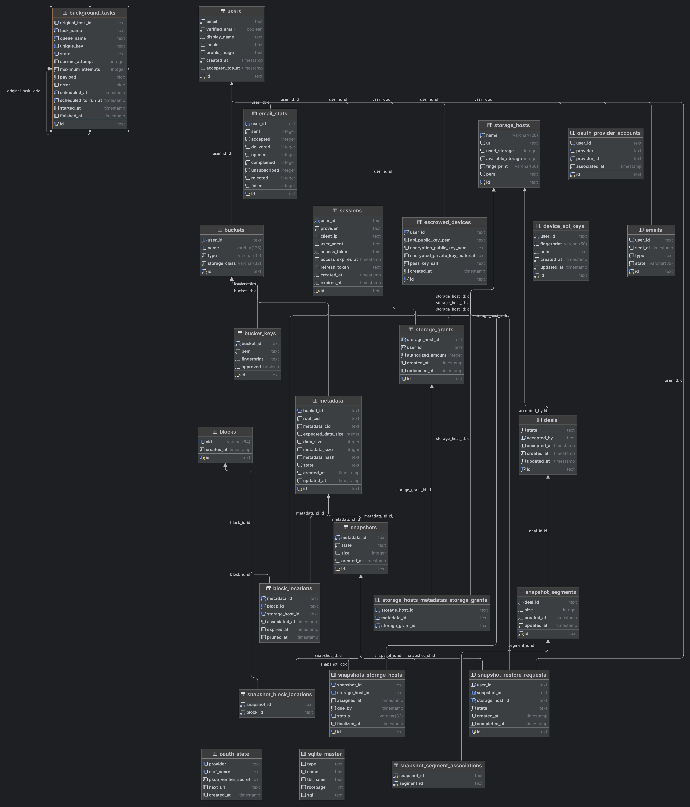
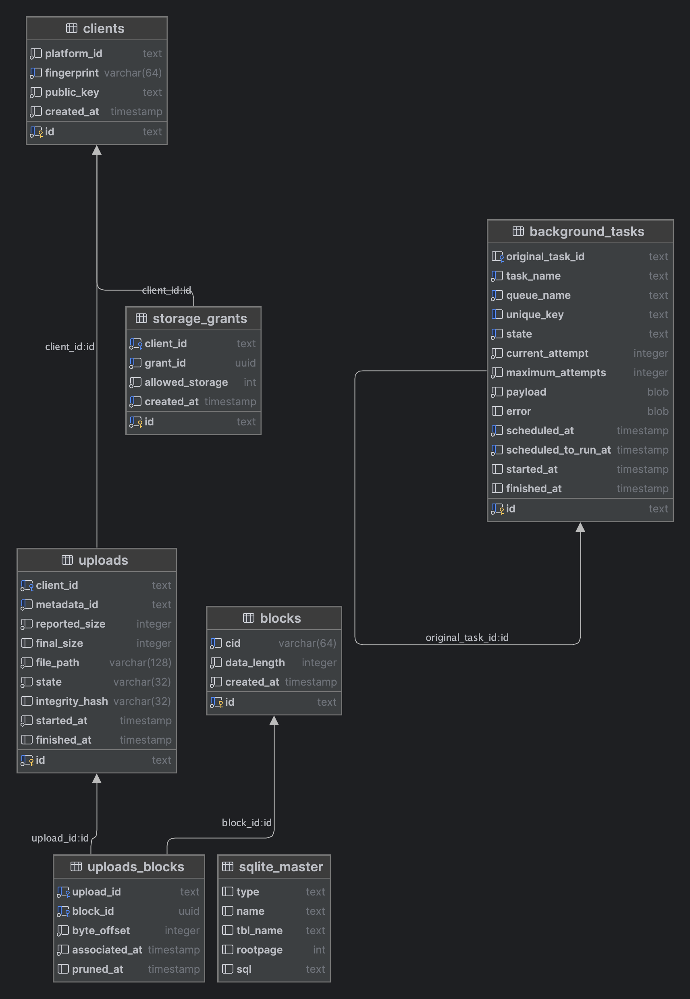

# 🌴 Banyan Core

This repository contains Banyan Computer's internal platform services.

## 💻 How to setup dev environment from scratch

This document will help you set up a new development environment to contribute
to this project. Please open a pull request if these instructions are
out-of-date.

### 📦 Dependencies

You should have a working Rust toolchain, yarn, and sqlite installed on your
machine.

### 🔧 Environment Setup

The core service uses a `.env` file to store environment variables. A sample
file exists as a starting point. You can copy that sample file into place
by running the following command:

```sh
cp crates/banyan-core-service/.env{.sample,}
```

Next, edit the `.env` file and provide the `GOOGLE_CLIENT_ID=` and
`GOOGLE_CLIENT_SECRET=` values for the project. You will need to get these from
someone that already has them.

This will only work with the development keys,
using other keys won't allow authentication and shouldn't exist on developer's
systems.

You'll also need to ensure that your account has been granted access to the
OAuth2 project if we're still in the testing phase of our application. This
needs to be done by someone with access to the Google Cloud Console ([direct
deeplink to the relevant
page](https://console.cloud.google.com/apis/credentials/consent?authuser=3&project=core-services-a465d267)).

### ✨ Automatic Clean Up / First Time Setup

The easiest way to set up a development environment is to use the
`reset_env.sh` helper script, which automatically performs the steps outlined
in this document below.

```sh
./bin/reset_env.sh
```

### 🐣 Manual Clean Up / First Time Setup

Some cleanup from prior runs, assumes you're in the root of this repository:

```sh
make clean
```

We need to generate the platform signing keys, this can be done by simply
starting up the core service and shutting it down. The
`generate-core-service-key` command will do this for you. To run against the
tomb CLI add the `--features fake` flag.

After that command has finished, the platform's public key should be copied
over to the `data/` directories of the staging and storage provider services.

```sh
make generate-core-service-key
cp -f crates/banyan-core-service/data/service-key.public crates/banyan-staging-service/data/platform-key.public
cp -f crates/banyan-core-service/data/service-key.public crates/banyan-storage-provider-service/data/platform-key.public
```

The staging and storage provider services have their own authentication
material that must be generated to authenticate with the core service. Once
again, this can be done by starting up the services and then shutting them
down. The `generate-staging-service-key` and
`generate-storage-provider-service-key` commands will perform this step for
you.

```sh
make generate-staging-service-key
make generate-storage-provider-service-key
```

Now, the staging and storage provider services must be registered in the sqlite
database as potential storage providers. This can be done by running the
following scipts:

```
source bin/add_staging_host.sh
source bin/add_storage_host.sh
```

The services should now be ready to interact with each other. The steps so far
only need to be run once or when the environment needs to be reset. The
remaining instructions are for bringing up the project assuming everything is
setup as documented here.

#### 🪟 Front-End Setup

Run `yarn install` to install JavaScript dependencies for the frontend.

```sh
cd crates/banyan-core-service/frontend
yarn install
cd -
```

This is only needed if you want to bring up the web interface locally.

**NB:** This command should be run once more whenever changes have been made to
the frontend.

## 🚀 Bringing Up Services

**📍 TIP:** a terminal multiplexer like tmux is recommended for this step.

To build the web interface, run these commands from the root of the repository:

```sh
cd crates/banyan-core-service/frontend
yarn build
cd -
```

In one terminal, start the core service by running:

```sh
cd crates/banyan-core-service
cargo run
```

In another terminal, start the staging service by running:

```sh
cd ../banyan-staging-service
cargo run
```

In another terminal, start the storage provider service by running:

```sh
cd crates/banyan-storage-provider-service
cargo run
```

You should now be able to open up your web-browser to
[http://127.0.0.1:3001](http://127.0.0.1:3001), login, and use the platform.

## 🔌 Connecting to the Databases

It can be helpful during development to query the SQL databases for the
core, staging, and storage provider services directly.

Each of these services' databases write to their respective `data/` directory.
The `Makefile` contains some commands to attach a sqlite prompt to each:

```sh
make connect-to-core-database
make connect-to-staging-database
make connect-to-storage-provider-database
```

### 💭 Helpful Commands

Use these commands to list databases, indexes, and tables.

* `.databases`: list names and files of attached databases
* `.indexes`: list names of indexes
* `.tables`: list names of tables
* `.schema`: show the `CREATE` statements for table(s)

For more information run `.help` in the sqlite prompt, or refer to the
[Official Documentation](https://www.sqlite.org/docs.html).

## 🔒 Updating Tomb WASM

In the tomb repository go to the `tomb-wasm` sub-crate. Build it with the
following command:

```sh
export BANYAN_CORE_CHECKOUT=~/workspace/banyan/banyan-core
wasm-pack build --release
rm -f ${BANYAN_CORE_CHECKOUT}/crates/banyan-core-service/frontend/tomb_build/
cp -f pkg/* ${BANYAN_CORE_CHECKOUT}/crates/banyan-core-service/frontend/tomb_build/
```


## Database Schema

### Core Service


### Staging Service

